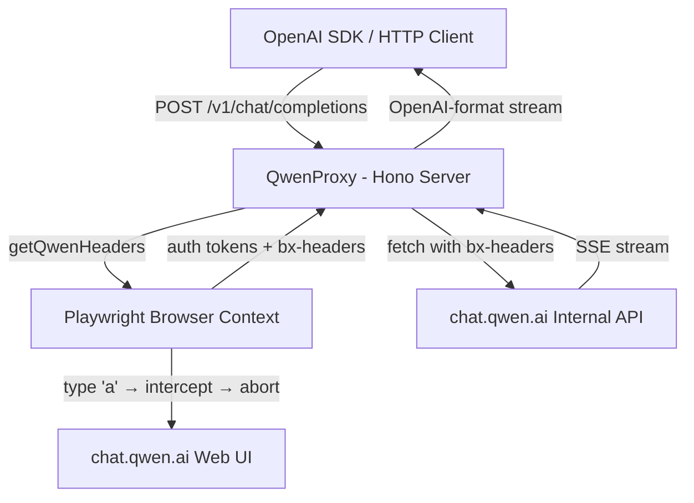

# QwenProxy — Overview

**Repo**: `github.com/youssefvdel/qwenproxy` (private)  
**Author**: Pedro Farias  
**Language**: TypeScript  
**Framework**: Hono (web server) + Playwright (browser automation)  
**License**: ISC

## What Is It?

An **OpenAI-compatible proxy** that lets you use any OpenAI SDK to talk to **Qwen (chat.qwen.ai) models**. Instead of using a direct API (which Qwen doesn't publicly expose), it:

1. Launches a real Playwright browser session
2. Extracts auth tokens + anti-bot headers (`bx-ua`, `bx-umidtoken`, `bx-v`) from the browser
3. Uses those headers to call Qwen's internal `chat.qwen.ai/api/v2/chat/completions` API directly via `fetch()`
4. Translates the Qwen-specific SSE stream into the OpenAI chat completions format

## Why Does This Exist?

Qwen doesn't offer a public OpenAI-compatible API. Their only interface is the web UI at `chat.qwen.ai`. This proxy **reverse-engineers the web API** and wraps it in a standard interface.

## Key Features

- `/v1/chat/completions` — OpenAI-compatible chat endpoint
- `/v1/models` — Model listing (with `-no-thinking` variants)
- Streaming (SSE) + Non-streaming
- Reasoning/thinking mode (`reasoning_content`)
- Tool/function calling via `<tool_call>` JSON tags
- Session persistence (cookies survive restarts via `qwen_profile/`)
- Auto-login (API + UI fallback)
- Docker support
- Heartbeat keep-alive (prevents Cloudflare 524 timeout during long thinking)

## Architecture in One Sentence

> "A Playwright-powered bridge that steals Qwen's auth tokens from the browser, then speaks OpenAI-compatible HTTP to clients while translating to Qwen's internal API."

## Core Constraint

Qwen's backend is **single-session/single-generation**. Only one active generation per chat session. Two concurrent requests to the same session produce:
```
Bad_Request: The chat is in progress!
```

This drives many design decisions: the global Mutex, retry logic, and the `sessionStates` parent-message tracking.

## Current State



## Files at a Glance

```
src/
├── index.ts              # Entry: Hono server setup, CORS, auth, browser init
├── login.ts              # Standalone login script
├── routes/
│   └── chat.ts           # 654-line god function: chat completions handler
├── services/
│   ├── playwright.ts     # Browser lifecycle, header interception, auth
│   └── qwen.ts           # Qwen API calls, stream creation, models fetch
├── tools/
│   ├── registry.ts       # Tool registration & lookup (clean)
│   ├── schema.ts         # JSON Schema validator (clean)
│   ├── executor.ts       # Agentic tool execution loop
│   ├── parser.ts         # Streaming <tool_call> parser
│   └── types.ts          # Tool type definitions
├── types/
│   └── openai.ts         # Full OpenAI-compatible types
├── utils/
│   ├── types.ts          # Re-export + extra types (overlap with above)
│   └── json.ts           # Robust JSON parser (LLM-output hardened)
├── runtime/
│   ├── types.ts          # State machine types (well-designed)
│   └── engine.ts         # State machine engine (only 71 lines — incomplete)
└── tests/
    ├── index.test.ts     # Main API tests
    ├── advanced.test.ts  # Reasoning, streaming, session tracking
    ├── agenticStress.test.ts  # E2E tool-calling stress test (real Qwen)
    ├── concurrentChat.test.ts # Concurrent request test
    ├── parser.test.ts    # Tool parser unit tests
    ├── delta.test.ts     # Incremental delta detection tests
    ├── jsonFix.test.ts   # JSON repair debug script (not real tests)
    └── parallel.test.ts  # Parallel tool execution test
```
