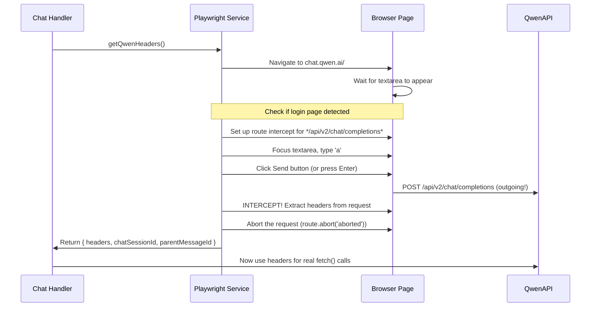

# The Magic: Playwright Header Interception

This is the **core innovation** of the entire project. Without this, nothing works.

## Why Is This Needed?

Qwen's internal API (`chat.qwen.ai/api/v2/chat/completions`) protects itself with dynamically-generated anti-bot tokens:

| Header | Source | What it is |
|---|---|---|
| `bx-ua` | Browser JS execution | Anti-bot user-agent fingerprint |
| `bx-umidtoken` | Browser JS execution | Device fingerprint token |
| `bx-v` | Browser JS execution | Version/algorithm identifier |
| `authorization` | Login cookies | Bearer token set after auth |
| `cookie` | Browser storage | Session cookies |

These tokens are **generated at runtime by Qwen's JavaScript** — you can't get them from a simple `fetch()`. This is a Proof-of-Work style anti-automation measure.

## The Trick

The proxy uses a **real Playwright browser** to:

1. Navigate to `https://chat.qwen.ai/`
2. Type a character (`"a"`) into the chat textarea
3. Wait for the "Send" button to activate
4. Click Send (or press Enter) — which triggers an XHR to `**/api/v2/chat/completions*`
5. **Intercept that outgoing request** via `page.route()`
6. **Extract the request headers** (which now include bx-ua, bx-umidtoken, bx-v, cookies)
7. **Abort the request** (so Qwen doesn't actually send a message)
8. **Cache the headers** for subsequent actual API calls

## The Code Flow



## Key Implementation Details

### Mutex on UI Operations
```typescript
// playwright.ts:53
const uiMutex = new Mutex();
```
Only one header extraction at a time. Prevents two concurrent requests from both typing into the browser simultaneously.

### Caching with TTL
```typescript
// playwright.ts:21-22
let lastHeadersTime = 0;
const HEADERS_TTL = 10 * 60 * 1000; // 10 minutes
```
Headers are cached to avoid the expensive browser dance on every request.

### Session Detection
The code checks if we're on a specific chat page (`/c/...`) vs the home page. If on a specific chat, it re-navigates home to avoid sending a message to an existing conversation.

### Send Button Saga
```typescript
const selectors = [
  '.message-input-right-button-send .send-button', // Current UI: WRONG selector
  '.chat-prompt-send-button',                       // Fallback
  'button.send-button'                              // Last resort
];
```
**This is the most fragile part** — the send button selectors in the code don't match the actual current Qwen UI. The actual structure is:
```html
<div class="message-input-right-button-send">
  <div class="omni-button-content">
    <div class="ant-dropdown-trigger omni-button-content-btn">
      <span>waveform icon</span>
    </div>
  </div>
</div>
```
The fallback `keyboard.press('Enter')` at the end is what actually works.

## Efficiency Problem

Each header refresh requires:
1. Page navigation (~1-2s)
2. Wait for textarea (~2-5s)
3. Type character + wait (~2-3s)
4. Click send button (fails with current selectors)
5. Press Enter fallback (~1s)
6. Wait for request interception + abort (~2-3s)

**Total: ~8-14 seconds** of browser interaction per refresh. With a 10-minute TTL, this is tolerable but could fail under high concurrency.
