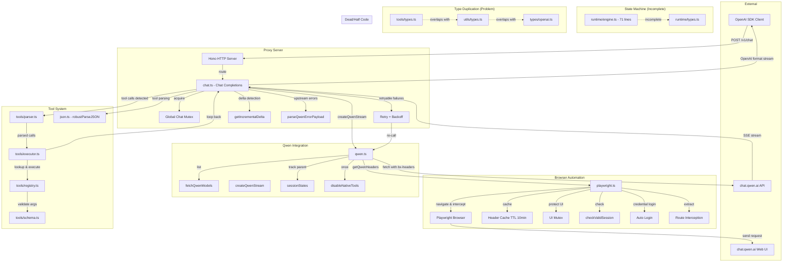

# Connections Map

How everything fits together.



## Data Flow: Headers

```
Browser JavaScript
      │
      │ generates bx-ua, bx-umidtoken, bx-v
      ▼
QwenUI page
      │
      │ outgoing POST to /api/v2/chat/completions
      ▼
getQwenHeaders() intercepts
      │
      │ extracts: cookie, bx-ua, bx-umidtoken, bx-v
      │ caches for 10 minutes
      ▼
createQwenStream() uses them for fetch()
      │
      │ real API call to Qwen
      ▼
QwenAPI responds with SSE stream
```

## Data Flow: Messages

```
Client sends: [{role:"user", content:"Hello"}]
      │
      ▼
chat.ts builds prompt:
  "User: Hello\n\n"
      │
      ▼
createQwenStream() wraps in Qwen format:
  { messages: [{ fid, role:"user", content:"User: Hello...", feature_config:{...} }] }
      │
      ▼
QwenAPI streams back:
  data: {"choices":[{"delta":{"phase":"answer","content":"Hi!"}}]}
      │
      ▼
chat.ts parses → OpenAI format:
  data: {"choices":[{"delta":{"content":"Hi!"}}]}
```

## Data Flow: Tool Calls

```
Qwen outputs:
  <tool_call>
  {"name": "read_file", "arguments": {"path": "hello.txt"}}
  </tool_call>
      │
      ▼
StreamingToolParser.feed() parses tags
      │
      ▼
ToolCall[] → executed via registry.execute()
      │
      ▼
Results appended as "Tool Response" message
      │
      ▼
Sent back to Qwen as continuation of conversation
```

## Constraint Chain

```
Qwen single-session limit
      │
      ▼
Global Mutex serializes requests
      │
      ▼
If another request arrives → it waits or retries
      │
      ▼
If "in progress" error passes through → retry with backoff
      │
      ▼
If all retries fail → error returned to client
```

## The Fragility Chain

```
Qwen UI changes send button class
      │
      ▼
Route interception fails
      │
      ▼
Can't extract bx-headers
      │
      ▼
Can't call Qwen API
      │
      ▼
Proxy is broken
```

The fix: current Enter key fallback bypasses the button entirely. But if Qwen changes Enter behavior too, it breaks.
