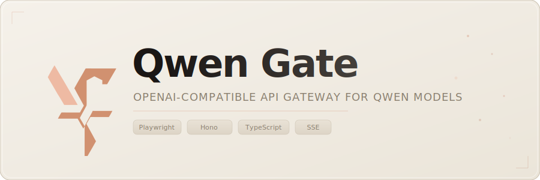

# Qwen Gate

<p align="center">
  
</p>

[](https://opensource.org/licenses/MIT)
[](https://nodejs.org/)
[](https://github.com/youssefvdel/qwen-gate/releases)
[](https://www.typescriptlang.org/)
[](https://playwright.dev/)

> **Disclaimer**: This project is for educational and study purposes. It provides access to Qwen models via `chat.qwen.ai` browser automation. Not affiliated with Alibaba Group or Qwen. Users must comply with `chat.qwen.ai`'s terms of service.

---

## Quick Start

```bash
curl -sSL https://raw.githubusercontent.com/youssefvdel/qwen-gate/main/install.sh | bash
cd qwen-gate
qg
```

Then open [http://localhost:26405/dashboard](http://localhost:26405/dashboard) to add accounts and start using the API.

## Features

- **OpenAI-Compatible API** — Drop-in replacement for `/v1/chat/completions` and `/v1/models`. Works with existing OpenAI SDKs, curl, or any HTTP client.
- **Multi-Account Rotation** — Configure multiple Qwen accounts. Requests are distributed via round-robin with automatic failover and cooldown tracking.
- **Session Pooling** — Browser sessions are pooled, reused, and autoscaled under load. No per-request login overhead.
- **Tool Calling** — Full OpenAI-style function calling with JSON Schema validation, echo detection, and spam guards.
- **Streaming SSE** — Server-Sent Events with heartbeat keep-alive and content filter integrity maintained across stream boundaries.
- **Content Filter Pipeline** — Strips tool call artifacts, XML leaks, thinking tags, and echo repetitions from model output.
- **Web Dashboard** — Real-time monitoring with 5 pages: overview, request log, account manager, network debug, and settings.
- **Stealth Browser Automation** — Uses CloakBrowser with anti-detection patches to maintain session integrity.
- **Update Notifications** — Automatically checks for new versions on startup and logs a warning when outdated.
- **No Build Step** — TypeScript executed directly via `tsx`. Run from source with no compilation needed.

## Installation

### One-Command Install (Linux / macOS)

```bash
curl -sSL https://raw.githubusercontent.com/youssefvdel/qwen-gate/main/install.sh | bash
```

This clones the repo, installs dependencies, creates `config.json`, and symlinks the `qg` / `qwengate` / `qwen-gate` CLI commands.

### Windows Install

Open **PowerShell** (as administrator) and run:

```powershell
powershell -ExecutionPolicy Bypass -c "curl.exe -sSL https://raw.githubusercontent.com/youssefvdel/qwen-gate/main/install.ps1 | iex"
```

Or clone manually:

```powershell
git clone https://github.com/youssefvdel/qwen-gate.git
cd qwen-gate
copy config.example.jsonc config.json
npm install
```

Then run `qg` to start the server.

### Manual Install

```bash
git clone https://github.com/youssefvdel/qwen-gate.git
cd qwen-gate
cp config.example.jsonc config.json
npm install
```

### Start the Server

```bash
qg
```

Or:

```bash
npm start
```

The server starts on [http://localhost:26405](http://localhost:26405).

### Add Accounts

1. Open [http://localhost:26405/dashboard/accounts](http://localhost:26405/dashboard/accounts)
2. Enter your Qwen email and password
3. Click **Add Account** — the gateway handles login and session persistence

## Usage

### Chat Completion

```bash
curl -X POST http://localhost:26405/v1/chat/completions \
  -H "Content-Type: application/json" \
  -H "Authorization: Bearer your-api-key" \
  -d '{
    "model": "qwen3-max",
    "messages": [{"role": "user", "content": "Hello!"}]
  }'
```

### Streaming

Set `"stream": true` for SSE:

```bash
curl -X POST http://localhost:26405/v1/chat/completions \
  -H "Content-Type: application/json" \
  -H "Authorization: Bearer your-api-key" \
  -d '{"model": "qwen3-max", "stream": true, "messages": [{"role": "user", "content": "Count to 5"}]}'
```

### Tool Calling

```bash
curl -X POST http://localhost:26405/v1/chat/completions \
  -H "Content-Type: application/json" \
  -H "Authorization: Bearer your-api-key" \
  -d '{
    "model": "qwen3-max",
    "messages": [{"role": "user", "content": "Weather in Paris?"}],
    "tools": [{
      "type": "function",
      "function": {
        "name": "get_weather",
        "parameters": {
          "type": "object",
          "properties": {"city": {"type": "string"}},
          "required": ["city"]
        }
      }
    }]
  }'
```

## Configuration

All settings in `config.json`. Key options:

| Key                       | Default      | Description                                     |
| ------------------------- | ------------ | ----------------------------------------------- |
| `PORT`                    | `"26405"`    | Server port                                     |
| `API_KEY`                 | `""`         | Bearer token for API auth (empty = no auth)     |
| `BROWSER`                 | `"chromium"` | Browser engine: `chromium`, `firefox`, `webkit` |
| `TOOL_CALLING`            | `"true"`     | Enable tool call parsing                        |
| `CLEAN_OUTPUT`            | `"true"`     | Strip internal artifacts from responses         |
| `ECHO_DETECTOR`           | `"true"`     | Detect tool-result echo leaks                   |
| `SAVE_REQUEST_LOGS`       | `"false"`    | Save per-request logs to disk                   |
| `OPEN_DASHBOARD_ON_START` | `"false"`    | Auto-open dashboard in browser                  |
| `RATE_LIMIT_COOLDOWN_MS`  | `"120000"`   | Cooldown after rate limit (2 min)               |
| `RETRY_MAX_ATTEMPTS`      | `"3"`        | Max retry attempts                              |

Full reference: [docs/API.md](docs/API.md) and `config.example.jsonc`.

## Architecture

<p align="center">
  
</p>

## Web Dashboard

Accessible at `http://localhost:26405/dashboard`.

| Page         | Path                  | Purpose                                              |
| ------------ | --------------------- | ---------------------------------------------------- |
| **Overview** | `/dashboard`          | KPIs, model health, system logs, session pool status |
| **Logs**     | `/dashboard/logs`     | Real-time request log with expandable entry details  |
| **Accounts** | `/dashboard/accounts` | Add/remove Qwen accounts, view auth status           |
| **Network**  | `/dashboard/network`  | Outbound API call inspector                          |
| **Settings** | `/dashboard/settings` | Live config editor (changes apply instantly)         |

## CLI

Three binary aliases: `qg`, `qwengate`, `qwen-gate`.

```text
Usage: qg [command] [options]

Commands:
  start          Start the API server (default)
  update         Pull latest code and reinstall dependencies
  restart        Restart the running server
  status         Check if the server is running
  help           Show help message

Options:
  --port <n>     Override port
  --browser <e>  Browser engine: chromium, firefox, chrome, edge
  --host <addr>  Bind address

Account management is done via the web dashboard → Accounts page.
```

## Updating

### Via CLI (easiest)

```bash
qg update
```

This runs `git pull --ff-only && npm install`. Then restart the server:

```bash
qg restart
```

### Manual

```bash
git pull && npm install && qg restart
```

### Re-run the installer

```bash
# Linux / macOS
curl -sSL https://raw.githubusercontent.com/youssefvdel/qwen-gate/main/install.sh | bash

# Windows (PowerShell)
powershell -ExecutionPolicy Bypass -c "curl.exe -sSL https://raw.githubusercontent.com/youssefvdel/qwen-gate/main/install.ps1 | iex"
```

The server checks for new GitHub releases on startup and logs a warning in the dashboard when an update is available.

## Project Structure

```text
src/
├── cli.ts                   CLI entry (qg command parser)
├── index.tsx                Hono server, routing, middleware
├── routes/                  API route handlers
│   ├── chat.ts              Chat completions dispatch
│   ├── chatStreaming.ts     Streaming SSE logic
│   ├── chatNonStreaming.ts  Non-streaming responses
│   ├── accounts.ts          Account CRUD API
│   ├── config.ts            Config read/write API
│   └── dashboard/           Web dashboard (vanilla HTML/JS)
├── services/                Business logic
│   ├── auth.ts              Auth orchestration
│   ├── accountManager.ts    Account CRUD, round-robin rotation
│   ├── sessionPool.ts       Session pool with autoscaling
│   ├── playwright.ts        Browser init & management
│   ├── qwenModels.ts        Model fetching & mapping
│   ├── modelRouter.ts       Model routing & fallback
│   ├── networkDebug.ts      Outbound call capture
│   ├── logStore.ts          In-memory log store + SSE
│   └── configService.ts     Config loader
├── tools/                   Tool calling system
│   ├── registry.ts          Tool registry
│   ├── parser.ts            Tool call parsing
│   ├── guard.ts             Spam/abuse guard
│   └── schema.ts            JSON Schema validation
├── utils/                   Shared utilities
│   ├── xmlStripper.ts       XML/tool call artifact removal
│   ├── contentFilter.ts     Streaming content filter
│   ├── retry.ts             Exponential backoff
│   └── logger.ts            Structured logger
└── middleware/
    └── rateLimit.ts         Token bucket rate limiter
```

## Testing

```bash
npm test
```

Uses the `node:test` runner. Covers content filtering, tool-call parsing, echo detection, and spam guard behavior.

## Documentation

| Document                             | Description                                   |
| ------------------------------------ | --------------------------------------------- |
| [Architecture](docs/ARCHITECTURE.md) | System design, component breakdown, data flow |
| [API Reference](docs/API.md)         | Full endpoint documentation                   |
| [Deployment](docs/DEPLOYMENT.md)     | Production deployment guide                   |
| [Development](docs/DEVELOPMENT.md)   | Contributing, testing, code conventions       |

## License

MIT — see [LICENSE](LICENSE).
